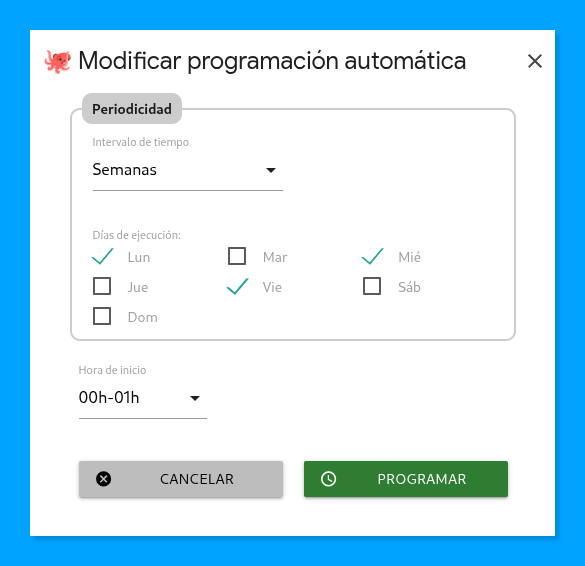
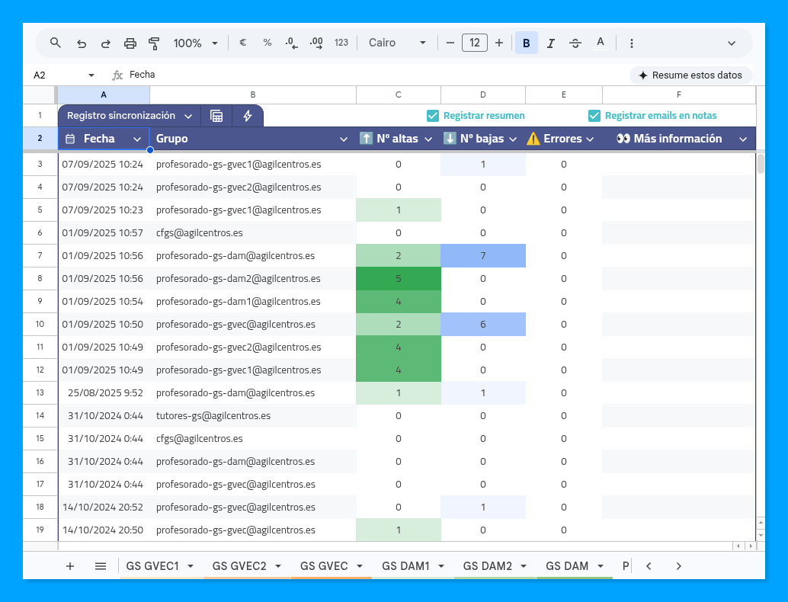
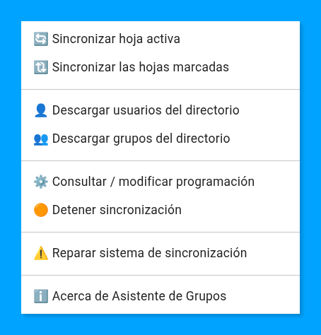

  

  
  
  

> 🐙 **Asistente de Grupos**: La herramienta definitiva para mantener tus grupos de Google Workspace en orden, sin perder la cordura en el proceso.

---

### 🎯 ¿De qué va esto?

Si gestionas un dominio de **Google Workspace**, sabrás que mantener los grupos de correo actualizados (claustros, departamentos, alumnos por niveles...) puede convertirse en un ritual semanal bastante tedioso. 

Este proyecto nace para automatizar ese proceso. Permite sincronizar listas de miembros (usuarios internos y externos) desde una sencilla hoja de cálculo hacia los grupos del servicio de **Google Groups**. 

La sincronización es **estrictamente unidireccional**: la lista de miembros del grupo será exclusivamente la indicada en la pestaña de cada grupo. El script añadirá nuevos miembros o eliminará los existentes que no estén en la hoja de manera automática e irrevocable.

> 💡 **Nota técnica sobre membresía:** El script soporta la inclusión de grupos como miembros de otros grupos, pero la comprobación de pertenencia se realiza de forma **directa**. Esto significa que el script no verifica si un usuario ya pertenece al grupo de forma anidada (a través de otro grupo intermedio) antes de procesar el alta o la baja.

### 📜 Una historia de cocción lenta (90% humana, 10% IA)

Este no es un proyecto de "usar y tirar" generado en 5 minutos por un bot. Su historia tiene solera:

1.  **El origen (junio 2023):** Fue creado de manera totalmente manual para resolver una necesidad real en el centro educativo donde soy Jefe de Estudios, Tecnología y Calidad (puedes ver el [tuit original de su gestación aquí](https://x.com/pfelipm/status/1671536677091770369)).
2.  **La prueba de fuego:** Ha estado funcionando en la sombra durante **3 cursos escolares completos** (23/24, 24/25 y 25/26) con una fiabilidad total.
3.  **El empujón final (mayo 2026):** Siempre quise liberarlo, pero me faltaba tiempo para pulir la interfaz de usuario. Gracias a **Gemini CLI**, en una mañana de sábado, hemos logrado cablear ese diálogo de programación granular, que estaba ya casi listo, y añadir alguna que otra mejora de usabilidad.

---

### ✨ Características principales

1.  **Sincronización inteligente:** Gestión de altas y bajas con un solo clic o de forma programada.
2.  **Planificador granular:** Olvídate de editar el código. Configura la ejecución automática con total flexibilidad:
    *   **Por horas:** Cada X horas (de 1 a 12).
    *   **Por días:** Cada X días (de 1 a 7) en una franja horaria específica.
    *   **Por semanas:** Selección de **días específicos de la semana** (ej. lunes, miércoles y viernes) a una hora determinada.
3.  **Registro y auditoría:** Historial detallado con notas de celda que enumeran los emails específicos afectados.
4.  **Directorio consolidado:** Obtención automática de usuarios (activos y suspendidos) y grupos del dominio.

---

### 🚀 Cómo empezar y flujo de trabajo

La distribución se realiza a partir de esta **[plantilla de Google Sheets](https://docs.google.com/spreadsheets/d/1ZwuDBCEZKd1ELFGHC67WAgTrJvWyHyNrBU0QG0P3Zso/edit?usp=sharing)** que debes duplicar.

#### 1. Preparación del directorio
Tras autorizar el script, el primer paso es poblar la hoja **"Directorio"**. Usa los comandos del menú para descargar los usuarios y grupos de tu dominio. Mediante fórmulas internas, se construirá un directorio consolidado:
*   Los emails en color normal son usuarios o grupos activos.
*   Los emails en **gris** corresponden a usuarios suspendidos.

#### 2. Configuración de grupos
Para cada grupo que desees gestionar:
1.  Duplica la pestaña **"Plantilla Grupo"**.
2.  Dale un nombre significativo (se recomienda usar códigos cortos).
3.  Rellena los campos necesarios (email del grupo y lista de miembros).
4.  Asegúrate de marcar el check de sincronización si quieres que se procese en las ejecuciones en lote.

#### 3. Ejecución de la sincronización
Puedes sincronizar de dos formas:
*   **Manual:** Desde el menú personalizado, sincroniza la hoja activa o todas las marcadas.
*   **Automática:** Usa el planificador para establecer una recurrencia.

  

---

### 📊 Control de registro y auditoría

La hoja **"Registro"** permite llevar un seguimiento exhaustivo de qué cambios se han realizado en cada grupo y cuándo. Para mayor comodidad, puedes controlar el nivel de detalle mediante dos interruptores en la propia hoja:

  

*   **☑️ Registrar resumen:** Si está activo, se insertará una nueva fila por cada operación de sincronización con el conteo de altas, bajas y errores.
*   **☑️ Registrar emails en notas:** Si está activo (y también el de resumen), las celdas de altas y bajas incluirán una **nota de celda** con el listado detallado de las direcciones de email afectadas. Solo tienes que pasar el ratón por encima para auditar el proceso.

---

### 🛠️ Comandos del menú

*   **🔄 Sincronizar hoja activa:** Procesa solo la pestaña en la que te encuentras.
*   **🔃 Sincronizar las hojas marcadas:** Sincroniza en lote todas las pestañas que tengan el check de activación marcado.
*   **👤 Descargar usuarios / 👥 Descargar grupos:** Actualiza los datos maestros del dominio en la hoja Directorio.
*   **🟢 Programar / ⚙️ Consultar o modificar programación:** Este comando es dinámico; mostrará la opción de programar si no hay un activador activo, o la de consultar/modificar si ya existe uno configurado. Abre el diálogo para gestionar la ejecución automática.
*   **🟠 Detener sincronización:** Elimina todos los activadores y detiene el proceso automático con confirmación visual.
*   **⚠️ Reparar sistema:** Limpia de forma profunda cualquier activador residual del proyecto.
*   **ℹ️ Acerca de...:** Información de versión y créditos.

 

---

### 🤝 Contribuciones

¿Has encontrado un bug o tienes una idea genial? Siéntete libre de abrir un *issue* o enviar un *pull request*. 

### ✍️ Autoría y agradecimientos

*   **Autor:** Pablo Felip ([@pfelipm](https://twitter.com/pfelipm))
*   **Licencia:** GNU GPL v3.
*   **Repositorio:** [https://github.com/pfelipm/asistente-grupos](https://github.com/pfelipm/asistente-grupos)

---

Hecho con ❤️, café y un poco de ayuda de Gemini CLI.

